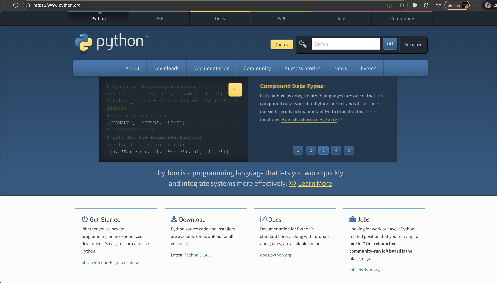
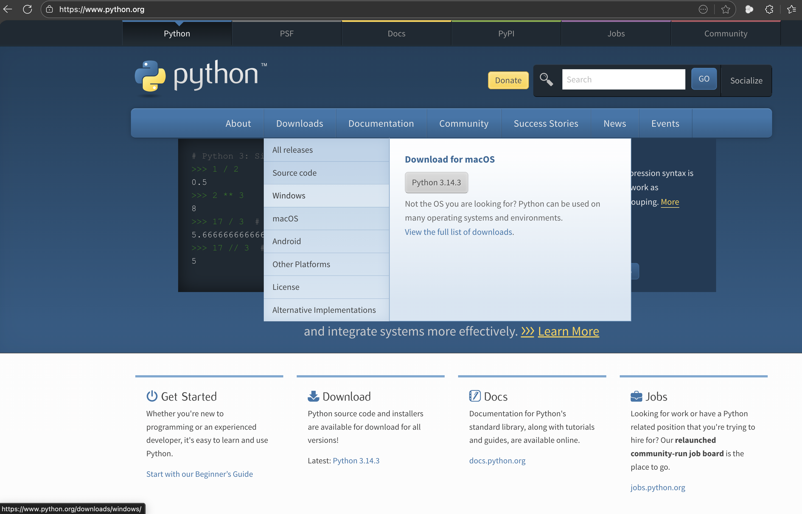
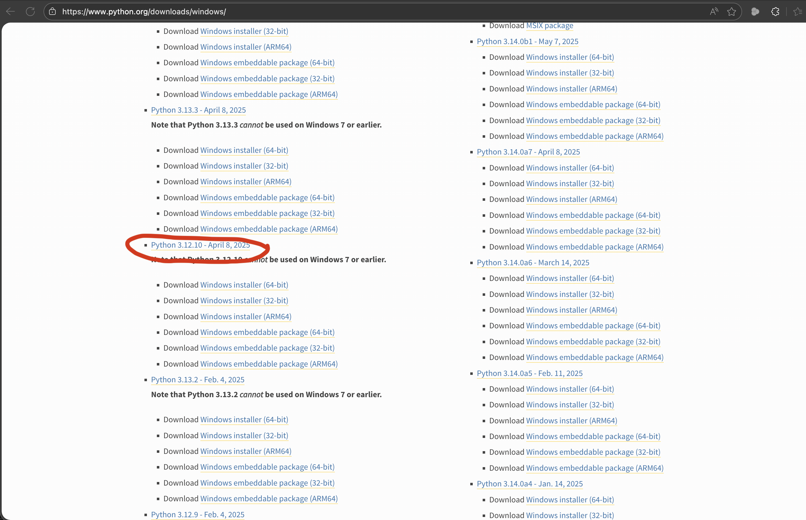
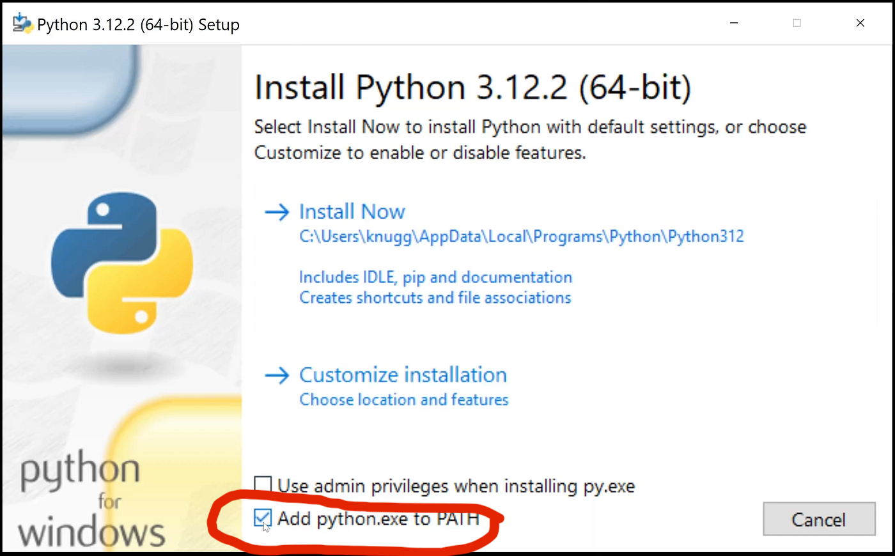

# 🧠 CTA-DEFACE — CPU-Only CT Defacing Pipeline (DICOM ⇄ NIfTI)

CTA-DEFACE is a **beginner-friendly** end-to-end pipeline for defacing CT head/neck scans:

> **DICOM → NIfTI → nnUNet (mask) → Defaced NIfTI → Defaced DICOM**

This fork adds:

- ✅ **CPU-only support** (no GPU / CUDA required)
- ✅ **Linux & Windows** setup and run scripts
- ✅ **Single-case and multi-case batch processing**
- ✅ **Full DICOM header reuse** (no anonymization, only PixelData is changed)
- ✅ **Robust handling of series, slice mismatches and nnUNet quirks**

⚠️ **Important:** This pipeline **does not anonymize DICOM metadata**.  
It only removes facial anatomy from image pixels.

---

## 🌍 Who is this for?

- Beginners with **zero experience** in nnUNet or medical imaging Python tooling  
- Medical physicists, radiologists, AI researchers  
- Anyone needing CT defacing **without GPU**  
- Anyone wanting a **ready-to-run**, fully automated DICOM → NIfTI → DEFACE → DICOM workflow

---

# 📁 Repository Contents

```
CTA-DEFACE/
│
├── run_CTA-DEFACE.py                 # nnUNet CPU inference + mask application
├── cta_deface_pipeline_multi2.py     # Full multi-case batch pipeline
├── cta_deface_convert.py             # Simple DICOM <-> NIfTI converter
│
├── setup_cta_deface_cpu.sh           # Linux CPU setup script
├── setup_cta_deface_cpu.ps1          # Windows CPU setup script
├── run_cta_deface_batch.ps1          # Windows batch runner
│
├── requirements_cpu.txt              # Linux dependencies
├── requirements_cta_deface_windows.txt
│
└── README.md                         # This file
```

---

# 🧱 Requirements

## Hardware
- Any **CPU-only** computer  
- RAM 8–16 GB recommended  
- Disk space: ~3× your DICOM dataset

## Software
- Python **3.10–3.12**
- Git
- Windows PowerShell **or** Linux bash

---

# 🐧 Linux Installation (Step by Step)

### 1. Clone repo
```bash
git clone https://github.com/jsfakian/CTA-DEFACE.git
cd CTA-DEFACE
```

### 2. Run setup
```bash
bash setup_cta_deface_cpu.sh
```

Creates `.venv_cta_deface/` and installs:
- nnUNetv2
- CPU-only PyTorch
- nibabel, SimpleITK, pydicom, tqdm, numpy…

### 3. Activate environment
```bash
source .venv_cta_deface/bin/activate
```

---

# ▶️ Linux: Running the Pipeline

### A. Single-case defacing
```bash
python cta_deface_pipeline_multi2.py     -i dicom_input     -o dicom_output
```

### B. Multi-case defacing
Input layout:
```
dicom_input/
 ├── case01/
 ├── case02/
 └── case03/
```

Run:
```bash
python cta_deface_pipeline_multi2.py     -i dicom_input     -o dicom_output     --nifti-root-out nifti_output
```

---

# 🪟 Windows Installation (Step by Step)

## 1. Install Git (Only once)

Git is required to download (clone) the project from GitHub.
Steps

    1. Go to: https://git-scm.com/download/win
    2. Download Git for Windows
    3. Run the installer
    4. During installation:
        Keep the default options
        Make sure "Git from the command line and also from 3rd-party software" is selected
    5. Finish installation

### Git Installation Screenshots


## 2. Verify Git installation

Open PowerShell and run: git --version

You should see something like: git version 2.x.x

### How to open PowerShell

1. Click the **Start** button (or press the **Windows key**)
2. Type **PowerShell**
3. Click **Windows PowerShell**


## 3. Install python 3.12

### 🐍 Step 1: Go to the official Python website

Open your browser and visit:

👉 https://www.python.org



Then:

Hover over Downloads

Click Windows



### 🐍 Step 2: Download Python 3.12 installer

On the Windows downloads page:

Find Python 3.12.x

Click “Download Python 3.12.x”



This downloads a file like:

```
python-3.12.x-amd64.exe
```

### 🐍 Step 3: Run the installer (IMPORTANT)

Double-click the downloaded .exe file.

⚠️ Before clicking Install, do this:

✅ Check “Add Python 3.12 to PATH”
✅ Then click “Install Now”

This step is critical.



### 🐍 Step 4: Finish installation

Wait for installation to complete

Click Close

If prompted about long path support → Allow

### 🧪 Step 5: Verify Python installation

Open PowerShell and run:

```
python --version
```

You should see:
```
Python 3.12.x
```

## 4. Clone this repo (one time)

1. Select a directory to clone the repo (e.g., documents)
2. Clone the repo

In the Powershell terminal run:
```
cd C:\Users\<username>\Documents
```
```
git clone https://github.com/jsfakian/CTA-DEFACE.git
```

## 5. Run setup and download `CTA_DEFACE` model from google

1. First allow Powershell to run ps1 scripts
2. Setup CTA deface
3. Download CTA deface model

In the PowerShell terminal run:

```
Set-ExecutionPolicy -Scope CurrentUser RemoteSigned
.\setup_cta_deface_cpu.ps1
.\download_cta_deface_model.ps1
```

---

# Prerequisites for run 

## Prepare the required directories and the dicom images for defacing

In the PowerShell terminal run:
```
mkdir dicom_input
mkdir dicom_output
mkdir work_deface_batch
```

Then place the dicom images you want to deface in `dicom_input`

---

# ▶️ Windows: Running the Pipeline

### Multi-case batch defacing

1. Open a PowerShell terminal
2. Go to the directory of the CTA-DEFACE
3. Activate the virtual environment of CTA-DEFACE
4. Run the `cta_deface_pipeline_multi2.py` script

Open a PowerShell terminal and run:

```
cd C:\Users\<username>\Documents\CTA-DEFACE
.\.venv_cta_deface\Scripts\Activate.ps1
python .\cta_deface_pipeline_multi2.py -i .\dicom_input\ -o .\dicom_output\ --nifti-root-out .\nifti_out\
```

---

# 🔧 What the Pipeline Does Internally

## 1️⃣ DICOM → NIfTI
- SimpleITK reads series
- Writes:  
  `work_deface_batch/<case>/nifti_in/<SeriesUID>_0000.nii.gz`

## 2️⃣ nnUNetv2 (CPU) defacing
`run_CTA-DEFACE.py` performs:
- Mask prediction (`*_mask.nii.gz`)
- Defaced reconstruction (`*_defaced.nii.gz`)  
  (face replaced by safe background intensity)

## 3️⃣ Selecting correct defaced NIfTI
Pipeline ensures:
- Picks `*_defaced.nii.gz`
- Verifies it differs pixel-wise from original

## 4️⃣ NIfTI → DICOM reconstruction
- Looks for best-matching SeriesInstanceUID
- Reuses **all** DICOM metadata:
  - PatientID
  - StudyInstanceUID
  - SeriesInstanceUID
  - Orientation
  - Slice geometry  
- Only `PixelData` is replaced

Output is written to:
```
dicom_output/<case>/<slice>.dcm
```

---

# 💻 CLI Reference

```
python cta_deface_pipeline_multi2.py     -i <dicom_root_in>     -o <dicom_root_out>     [--nifti-root-out PATH]     [-w work_deface_batch]     [--cta-extra-args ...]
```

---

# 📚 Citation

Please cite:

**Mahmutoglu et al. (2024), CTA-DEFACE — Deep learning-based CT defacing**  
_European Radiology Experimental_

---


